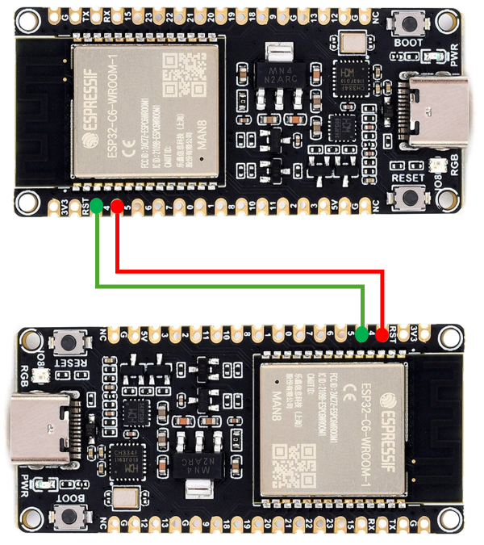

# Transmitter Module: ESP-NOW Reciever Code  

Arduino firmware for the ESP-NOW Receiver module in an automated flow rack tracking system. This module collects sensor data via ESP-NOW, processes it, and forwards it over UART to the Wi-Fi transmitter.  

Owner: **Kaveesha Abeysundara** (SID: 201578163)    

Project: **Automated Tracking of Assembly Line-Side Flow Rack Parts**   

School of Mechanical Engineering   
University of Leeds  
LS2 9JT


## Table of Contents

- [About](#about)
- [Hardware Setup](#hardware-setup)
- [Prerequisites](#prerequisites)
- [Installation](#installation)
- [Usage](#usage)
- [Data Structures & Communication](#data-structures--communication)
- [Repository Structure](#repository-structure)
- [License](#license)
- [Contact](#contact)

## About

The ESP-NOW Receiver module firmware listens for data packets from multiple sensor modules using the ESP-NOW protocol. It dynamically registers new peers, deserializes incoming measurement packets, and aggregates them before sending over a secondary UART connection to a Wi-Fi-enabled transmitter module for cloud upload.

## Hardware Setup

| Connection       | ESP32 Pin | Description                    |
|------------------|-----------|--------------------------------|
| UART TX          | 4         | Serial output to transmitter   |
| UART RX          | 5         | Serial input from transmitter  |

  

> Ensure the UART pins oppose the transmitter module's RX/TX configuration, and share a common ground.

## Prerequisites

- Arduino IDE v1.8.10+ with ESP32 board support
- **ESP32 Arduino** core (for Wi-Fi & ESP-NOW)
- **ArduinoJson** library for packet serialization
- USB cable and ESP32 development board

## Installation

```bash
git clone https://github.com/kav12ab/espnowreceivercode.git
cd espnowreceivercode
```

1. Open `ReceiverModule.ino` in the Arduino IDE.
2. Install dependencies via **Sketch → Include Library → Manage Libraries** (search for `ArduinoJson`).
3. Configure peer list capacity and callback settings in `config.h` if needed.

## Usage

1. Select **ESP32 Dev Module** and correct COM port.
2. Upload `ReceiverModule.ino` to the ESP32 board designated as the receiver.
3. Monitor Serial Monitor at **115200 baud** to see incoming ESP-NOW packets and UART forwarding logs.

## Data Structures & Communication

Incoming ESP-NOW packets conform to the following JSON schema:
```json
{
  "scanID": 1234,
  "boxCount": 5,
  "autoMode": true,
  "autoBoxSize": 150
}
```
Upon reception, the module:
1. Parses JSON into a `SensorData` struct.
2. Buffers or relays data immediately over UART in CSV format:
   ```
   <scanID>,<boxCount>,<autoMode>,<autoBoxSize>\n
   ```

## Repository Structure

```plaintext
espnowreceivercode/
├── .vscode/                              # JSON files for VSCODE Arduino Configuration
├── build/                                # Build logs, libraries and other files
├── ESP32_Transmitter_Module_Wiring.png   # Wiring Diagram
├── reciever.ino                          # Main programme
├── .h and .cpp files                     # Custom libraries to support main program functionality
└── README.md                             # This file
```
Given below is a outline of each core code component and its functionality
| File | Purpose |
|------|---------|
| `receiver.ino` | Initializes serial and ESP-NOW, merges incoming sensor data with predefined values, and forwards configuration updates via serial. |
| `ESPNOWHandler.h` / `ESPNOWHandler.cpp` | Initializes ESP-NOW communication, handling incoming sensor data, dynamic peer addition, and sending configuration responses. |
| `SensorData.h` / `SensorData.cpp` | Define sensor data structures and provide helper functions to manage and look up sensor information. |

## License

**All rights reserved.**

This firmware and documentation are proprietary to Kaveesha Abeysundara. No reuse, modification, or distribution is allowed without permission.

## Contact

**Author:** Kaveesha Abeysundara (SID: 201578163)  

Open an issue at [espnowreceivercode issues](https://github.com/kav12ab/espnowreceivercode/issues).


## Repository Structure

Below is a table of the key files and their purposes:


## License

**All rights reserved.**

This firmware and documentation are proprietary to Kaveesha Abeysundara. No reuse, modification, or distribution is allowed without permission.

## Contact

**Author:** Kaveesha Abeysundara (SID: 201578163)  
**Supervisor:** Krzysztof Kubiak  

Open an issue at [espnowreceivercode issues](https://github.com/kav12ab/espnowreceivercode/issues).


